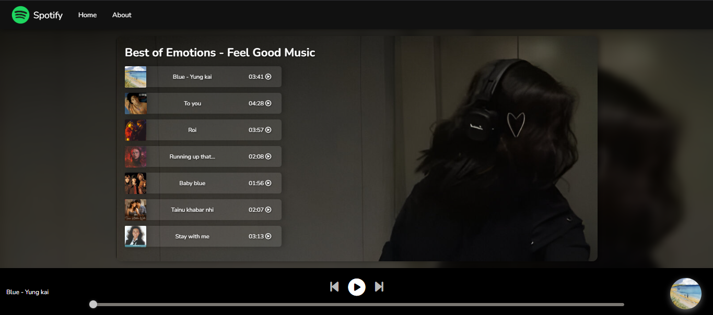

# 🎵 Spotify Clone

A simple and responsive **Spotify-style music player** built using **HTML**, **CSS**, and **JavaScript** — without any libraries or frameworks. This project mimics the core interface and functionality of Spotify's web player.

## 🚀 Features

- 🎧 Play / Pause music
- ⏭️ Switch between songs (Next / Previous)
- 🎵 Auto-update song title, and cover image
- 📊 Dynamic progress bar that syncs with the music
- 🔊 Basic layout using plain CSS

## 🛠️ Tech Stack

- ✅ **HTML5**
- ✅ **CSS3** (Plain CSS — no Bootstrap, Tailwind, or other frameworks)
- ✅ **JavaScript** (No external libraries)

## 📁 Folder Structure

spotify-clone/
├── index.html
├── style.css
├── script.js
└── assets/
├── songs/
└── covers/

## 🖼️ Screenshots
> 

## 📦 How to Run

1. **Clone the repository**
   ```bash
   git clone https://github.com/your-username/spotify-clone.git

👨‍💻 Author
Your Name
@dalipkumar4

📃 License
This project is licensed under the DK License.
